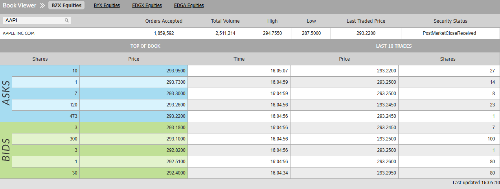

# Lightning

## Lightning - a high performance limit order book. 
Lightning is a phenomenon in nature consisting of electrostatic discharges occuring through the atmosphere between two electrically charged regions. I, as many others, have seen lightning - when lightning strikes down from the sky (or up from the ground), it sometimes branches out... taking on a sort of tree-like appearance. Why? Because it seeks the path of least resistance through the air. Similarly, an order book is all about paths of least resistance. A buyer seeks a seller willing to sell for the lowest price, and a seller seeks a buyer willing to buy for the highest price. You can consider any such buyer or seller as lightning: looking for the path of least resistance, or largest gain, for themselves. 

Source: https://www.cboe.com/us/equities/market_statistics/book/aapl/